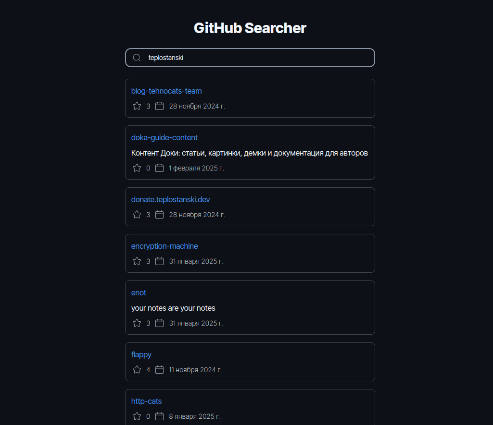

# GitHub Searcher

Интерактивное React-приложение для просмотра GitHub репозиториев пользователей.



[teplostanski.github.io/test-task-fewcha-github-searcher](https://teplostanski.github.io/test-task-fewcha-github-searcher)

## Тестовое задание на позицию frontend разработчика

Необходимо создать простое веб-приложение, которое позволяет пользователям искать репозитории на GitHub по имени пользователя и отображать информацию о найденных репозиториях. Используйте GitHub API для получения данных: [GitHub Repositories API](https://docs.github.com/en/rest/repos/repos?apiVersion=2022-11-28#list-repositories-for-a-user).

Дополнительным плюсом будет: Финальный билд приложения должен быть запускаться из **Docker контейнера** (хотябы с минимальной конфигурацией)

**Функционал**

- Должно быть текстовое поле куда можно ввести имя пользователя. Триггером к поиску является ввод пользовательского текста. Запросы к api github не должны быть избыточными

- После получения данных, должны появляться карточки с информацией о репозиториях пользователя, информация включает:

  - Название репозитория
  - Описание (если доступно)
  - Ссылку на репозиторий
  - Количество звёзд (stars)
  - Дату последнего обновления

- В момент ожидания ответа от github api должен быть индикатор загрузки

- Необходимо реализовать пагинацию с шагом 20, триггером к выполнению запроса за следующей страницей должна стать прокрутка экрана вниз, то есть необходимо реализовать механизм бесконечной прокрутки

- Если пользователь вводит некорректное имя пользователя или если возникают ошибки при запросе к API, приложение должно отображать соответствующее сообщение об ошибке понятное человеку.

**Замечания**

- **Обязательно** использование React, Redux/MobX.

- **Желательно** Typescript, Redux-toolkit

- Использование сторонних библиотек будет плюсом только в случае если это оправданно и вы сможете объяснить причину выбора. Показав свои знания в грамотном применении сторонних готовых решений, вы имеете шанс повысить свою профессиональную привлекательность для нас.

- Пишите код так, как бы вы его писали в работе &mdash; внутренности задания будут оцениваться даже тщательней, чем внешнее соответствие заданию. Код должен быть организован так, чтобы его можно было заново использовать.

- Помните про обработку ошибок!

- Верстка может быть самая простая, однако она не должна ломаться при разрешениях от 320px до 1920px. Визуализацию и украшение делайте на ваш вкус. Мы не против использования [tailwind css](https://tailwindcss.com/) или похожего UI фреймворк, но только для UI представления (нельзя использовать JS код для решения задачи, но можно использовать для оформительских эффектов (анимации и тому подобное))!

---

### ✨ Особенности

- 🚀 **Оптимизированная производительность**: Бесконечная прокрутка, дебаунс поиска
- 🎨 **Современный UI**: Адаптивный дизайн, анимации, тёмная тема
- 🔍 **Эффективный поиск**: Минимум запросов к API с максимальной производительностью
- 📱 **Отзывчивый интерфейс**: Адаптирован под все устройства
- ♿ **Доступность**: Полная поддержка ARIA для скринридеров

### 🛠️ Технологии

- **Frontend**: React, TypeScript, Redux Toolkit, RTK Query
- **Стилизация**: Tailwind CSS, Hero UI
- **Сборка**: Vite, SWC
- **Тестирование**: Vitest, Testing Library
- **CI/CD**: GitHub Actions
- **Контейнеризация**: Docker

### 🚀 Быстрый старт

```bash
# Установка зависимостей
npm install

# Запуск в режиме разработки
npm run dev

# Сборка для продакшена
npm run build

# Запуск тестов
npm run test
```

#### 🐳 Docker

```bash
# Сборка образа
docker build -t github-repos-app .

# Запуск контейнера
docker run -p 8080:80 github-repos-app
```

### 🎯 Ключевые фичи

- Поиск репозиториев по имени пользователя
- Бесконечная прокрутка результатов
- Отображение детальной информации о репозиториях
- Адаптивный и доступный интерфейс

### 📦 Архитектура

Проект следует принципам `Feature-Sliced Design (FSD)` используя подход `Pages first`.
